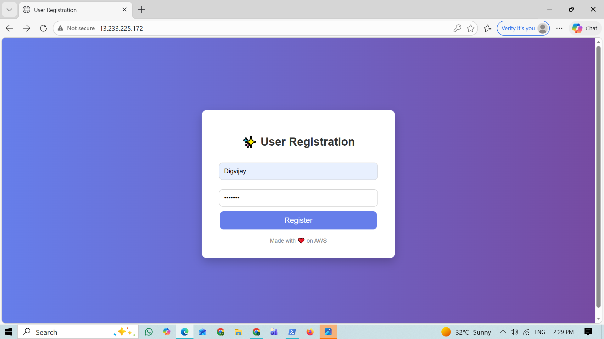
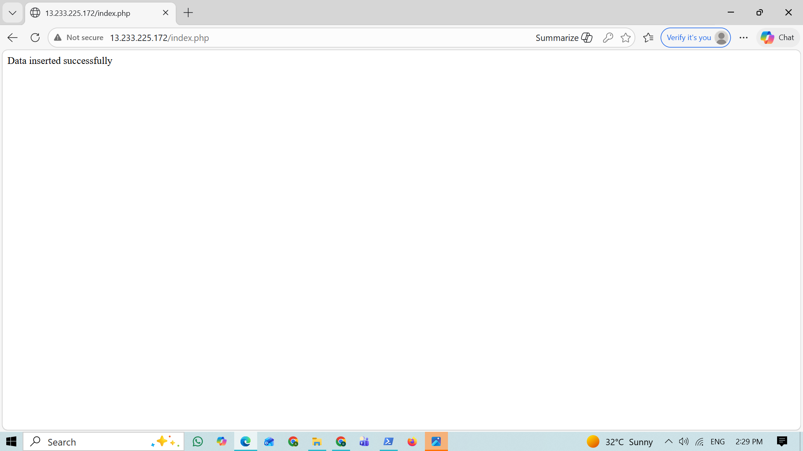
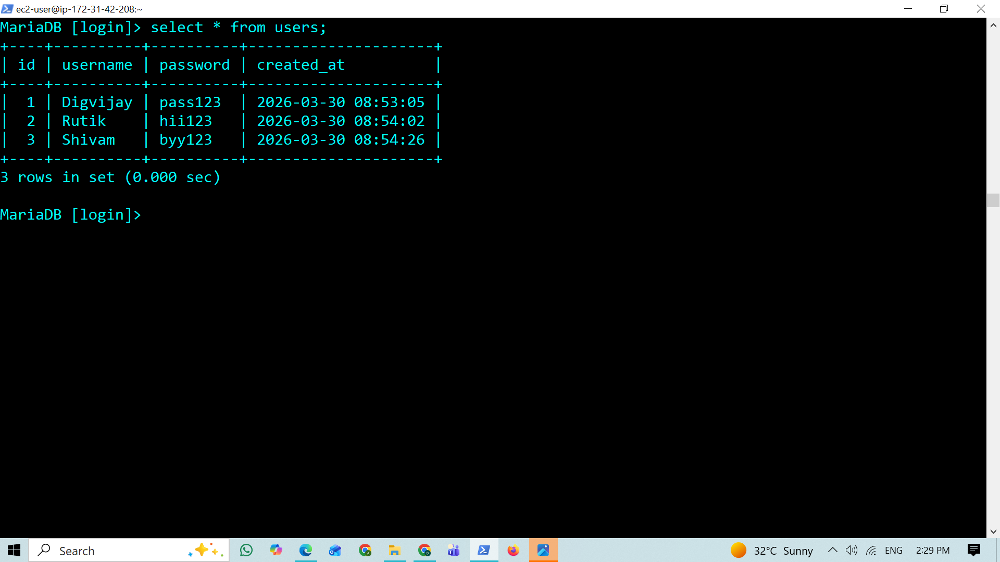
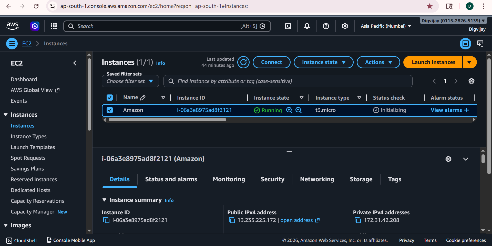

# 🚀 PHP-MySQL User Registration App on AWS EC2

## 📌 Project Overview

This project is a simple web application built using **HTML, PHP, and MariaDB (MySQL)** and deployed on an **AWS EC2 (Amazon Linux)** instance using **Nginx and PHP-FPM**.

The application allows users to enter their username and password through a web form, and the data is stored in a database.

---

## 🎯 Objectives

* Deploy a web application on AWS EC2
* Configure Nginx web server with PHP-FPM
* Connect PHP with MariaDB database
* Store user data from a form into a database
* Understand real-world debugging and setup process

---

## ⚙️ Tech Stack

* HTML
* PHP
* MariaDB (MySQL)
* Nginx
* PHP-FPM
* AWS EC2 (Amazon Linux)

---

## ☁️ Step 1: Launch EC2 Instance

* Created an EC2 instance using Amazon Linux
* Allowed inbound rules:

  * Port 22 (SSH)
  * Port 80 (HTTP)
* Connected to instance using SSH

---

## 🌐 Step 2: Install Nginx Web Server

```bash
sudo yum install nginx -y
sudo systemctl start nginx
sudo systemctl enable nginx
```

* Verified Nginx is running by accessing:

```
http://<public-ip>
```

---

## 🐘 Step 3: Install PHP and PHP-FPM

```bash
sudo yum install php php-fpm php-mysqlnd -y
sudo systemctl start php-fpm
sudo systemctl enable php-fpm
```

* Configured Nginx to handle PHP files using PHP-FPM

---

## 🗄 Step 4: Install MariaDB (MySQL)

```bash
sudo yum install mariadb105-server -y
sudo systemctl start mariadb
sudo systemctl enable mariadb
```

* Secured installation and set root password

---

## 🧪 Step 5: Create Database and Table

Logged into MySQL:

```bash
mysql -u root -p
```

Created database and table:

```sql
CREATE DATABASE login;

USE login;

CREATE TABLE users (
    id INT AUTO_INCREMENT PRIMARY KEY,
    username VARCHAR(50),
    password VARCHAR(255)
);
```

---

## 🔗 Step 6: PHP-MySQL Connection

Used PHP MySQL connector (`mysqli`) to connect:

```php
$conn = new mysqli("localhost", "root", "your_password", "login");
```

---

## 📝 Step 7: Create HTML Form

* Created a user registration form using HTML
* Fields:

  * Username
  * Password
* Form submits data to PHP backend

---

## ⚙️ Step 8: PHP Backend (insert.php)

* Collected form data using `$_POST`
* Inserted data into database using SQL query

```php
$sql = "INSERT INTO users (username, password) VALUES ('$username', '$password')";
```

---

## 🔄 Application Flow

1. User opens the web page
2. Enters username and password
3. Form sends data to PHP
4. PHP connects to database
5. Data is inserted into table
6. Success message displayed

---

## 📸 Screenshots

### 📝 User Form



### ✅ Data Inserted Successfully



### 🗄 Database Entries



### ☁️ AWS EC2 Instance



---

## 🧠 Learning Outcomes

* Learned how to deploy applications on AWS EC2
* Configured Nginx with PHP-FPM
* Connected PHP with MariaDB database
* Understood Linux server setup and troubleshooting
* Debugged real-world issues (404, PHP errors, DB connection)

---

## 🔐 Future Improvements

* Implement password hashing using `password_hash()`
* Use prepared statements to prevent SQL injection
* Deploy database on AWS RDS
* Dockerize the application
* Add login system and authentication

---

## 💡 Author

Digvijay Gogawale
